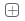

# 计划功能单元建模——产品型号

## 1 APP简介
>
>对制定生产计划过程中的物料进行建模，配置其型号、名称、替换件、必选件、可选件等相关信息。
>
>

## 2 APP功能点

> ### 2.1 新建产品型号模型
>
>点击菜单栏上方  ，弹出新增窗口；选择产品类型，下方表格中自动展示对应类型的物料信息，输入模型名称，选择需要建模的物料，创建一个产品型号模型。
>
>
>
> ### 2.2 配置产品型号信息
>
> - **主产出/副产出物料**
>> 产品编码：物料号；
>> 产品名称：物料名称；
>> 单位输出：每单位投入对应的产出；
>> 良品率：理论产品合格率；
> - **通用件/必选件/可选件**
>> 损耗率：生产过程中变为不良品的几率；
>> 可替换物料：生产过程中可以替换的物料；
>> 类型：物料属于标准件还是替换件；
>
> ### 2.3 保存产品型号模型
>
> 点击保存按钮，将配置好的信息保存为未发布的状态。
>
> ### 2.4 发布产品型号模型
>
> 点击发布按钮，将保存的模型发布。**（注意：只有发布后的产品模型才能够被使用！）**

## 3 业务场景

> ### 3.1 配置生产单元
>
> 在生产单元配置过程中，为每个生产单元配置投入产出的物料，需要从已经新建的产品模型中选择。。。
>
> ### 3.2 主计划制定
>
> XXXXXXXXXXXXXXXXXXXXXXXXX